# Architektur – Meshhessen Client

Stand: v1.5.14 · abgeleitet aus dem aktuellen Quellcode (`Services/`, `Models/`, Fenster im Projektroot).

Der Client ist schichtweise aufgebaut mit `MainWindow` als zentraler Drehscheibe.
Empfangsdaten fließen von unten (Gerät) nach oben (UI) über **Events**, Befehle den
umgekehrten Weg über `SendXxxAsync`-Methoden. Zwei Muster prägen alles: der
**geteilte `MeshtasticProtocolService`** (ein Verbindungszustand für die ganze App)
und die **`IConnectionService`-Abstraktion** (Serial/BLE/TCP komplett austauschbar).

## Modul- und Kommunikationsdiagramm

```mermaid
flowchart TB

  %% ---------- External ----------
  subgraph EXT["🌐 Externe Welt (außerhalb des Prozesses)"]
    direction LR
    DEV["Meshtastic-Gerät<br/>USB · BLE · TCP"]
    RTILE["tile.meshhessenclient.de<br/>Raster-Kacheln"]
    VTILE["vectortile.meshhessenclient.de<br/>Styles · MVT · Glyphs · Sprites"]
    MQTTB["MQTT-Broker"]
    PHONE["Handy-Apps<br/>Android / iOS"]
  end

  %% ---------- Transport ----------
  subgraph XPORT["🔌 Transport – IConnectionService"]
    direction LR
    SER["SerialConnectionService<br/>(→ SerialPortService)"]
    BLE["BluetoothConnectionService"]
    TCP["TcpConnectionService"]
  end

  %% ---------- Protocol core ----------
  subgraph PROTO["⚙️ Protokoll-Kern"]
    PROTOSVC["MeshtasticProtocolService<br/>Protobuf en/decode · ~25 Events · SendXxxAsync"]
    PKI["PkiDecryptionService<br/>X25519 + AES-256-CTR"]
    NKS["NodeKeyService<br/>Public-Key-Auflösung (CSV)"]
  end

  %% ---------- Bridges ----------
  subgraph BRIDGE["🔀 Server-Brücken"]
    direction LR
    VNODE["VirtualNodeService<br/>TCP-Server :4404"]
    MQTTP["MqttProxyService"]
  end

  %% ---------- Hub ----------
  HUB["🖥️ MainWindow<br/>ObservableCollections · Event-Verdrahtung · Fenster-Spawner · besitzt Karte"]

  %% ---------- Windows ----------
  subgraph WIN["🪟 Fenster & Dialoge (≈23)"]
    direction LR
    DM["DirectMessagesWindow"]
    CFG["NodeConfig / RemoteAdmin"]
    TRW["Traceroute / SegmentSnr"]
    TEL["Telemetry / Dashboard"]
    MISC["NodeInfo · MapPicker · TDeck …"]
  end

  %% ---------- Persistence ----------
  subgraph PERSIST["💾 Persistenz (querschnittlich)"]
    direction LR
    SET["SettingsService<br/>*.ini"]
    TDB["TelemetryDatabaseService<br/>telemetry.db"]
    MDB["MessageDbManager<br/>+ MessageDatabaseService"]
    LOG["Logger · MessageLogger · LocationLogger"]
  end

  %% ---------- Map ----------
  subgraph MAP["🗺️ Karten-Subsystem (zwei Renderer)"]
    direction LR
    RAS["Mapsui MapControl (Raster)<br/>BruTile ITileProvider"]
    VEC["WebView2 + map.html (Vektor)<br/>MapLibre GL JS"]
    VCACHE["VectorTileCacheService<br/>Interceptor + Disk-Cache"]
    MTOOLS["MapOverlayRegistry · VectorPackageDownloader<br/>TileDownloader · TileMigration · TDeckTile/Drive"]
  end

  %% ---------- Edges: inbound / outbound ----------
  DEV -- "byte[]-Frames" --> XPORT
  XPORT -- "DataReceived (byte[])" --> PROTOSVC
  PROTOSVC -- "WriteAsync" --> XPORT
  XPORT -- "USB/BLE/TCP" --> DEV

  PROTOSVC --- PKI
  PROTOSVC --- NKS

  PROTOSVC -- "~25 typisierte Events" --> HUB
  HUB -- "SendXxxAsync" --> PROTOSVC

  %% ---------- Bridges ----------
  PROTOSVC -- "RawFrameReceived (via MainWindow)" --> VNODE
  VNODE -- "App-Kommandos · WriteAsync" --> XPORT
  VNODE <-->|TCP| PHONE
  PROTOSVC <-->|MqttClientProxyMessage| MQTTP
  MQTTP <-->|MQTT| MQTTB

  %% ---------- Hub distributes ----------
  HUB -- "geteilter ProtocolService + DB" --> WIN
  HUB --> PERSIST
  HUB --> MAP

  %% ---------- Persistence detail ----------
  PROTOSVC -- "Telemetrie schreiben" --> TDB
  TEL -- "lesen" --> TDB
  DM -- "lesen/schreiben" --> MDB

  %% ---------- Map detail ----------
  VEC <-->|"JS-Bridge (postMessage)"| HUB
  VEC -- "HTTP-Requests" --> VCACHE
  VCACHE -- "UA + Cache" --> VTILE
  RAS -- "Kacheln" --> RTILE

  %% Rahmenfarben pro Schicht – lesbar in GitHub Hell- und Dunkelmodus
  classDef ext stroke:#7a6cd6,stroke-width:2px;
  classDef xport stroke:#b26a1f,stroke-width:2px;
  classDef proto stroke:#0e9cb8,stroke-width:2px;
  classDef bridge stroke:#e2683c,stroke-width:2px;
  classDef hub stroke:#4a86ee,stroke-width:3px;
  classDef persist stroke:#c25689,stroke-width:2px;
  classDef map stroke:#3aa96c,stroke-width:2px;
  classDef win stroke:#4a86ee,stroke-width:2px;

  class DEV,RTILE,VTILE,MQTTB,PHONE ext;
  class SER,BLE,TCP xport;
  class PROTOSVC,PKI,NKS proto;
  class VNODE,MQTTP bridge;
  class HUB hub;
  class DM,CFG,TRW,TEL,MISC win;
  class SET,TDB,MDB,LOG persist;
  class RAS,VEC,VCACHE,MTOOLS map;
```

## Kommunikationswege im Detail

| Weg | Auslöser & Nutzlast | Was passiert |
|---|---|---|
| Gerät → **Transport** → Protokoll | Rohframe als `byte[]` über `DataReceived` | ProtocolService dekodiert Protobuf, entschlüsselt PKI-DMs (PkiDecryptionService), löst Keys auf (NodeKeyService), schreibt Telemetrie in die DB |
| Protokoll → **MainWindow** | ~25 `EventHandler<T>` (z. B. `MessageReceived`) | Handler aktualisieren die `ObservableCollection`s; WPF-Databinding rendert die Listen; Kartenlayer bekommen neue Node-Pins |
| UI → **Protokoll** → Gerät | UI-Aktion ruft `SendXxxAsync(...)` | Protobuf-Encode → `IConnectionService.WriteAsync` → Transport → Gerät (auch NodeConfig/RemoteAdmin über den geteilten ProtocolService) |
| Protokoll ↔ **VirtualNode** ↔ Handy | `RawFrameReceived` / TCP-Bytes | Jeder Frame vom physischen Node geht an die App; App-Kommandos schreibt VirtualNode zurück auf die physische Verbindung |
| Protokoll ↔ **MqttProxy** ↔ Broker | `MqttClientProxyMessage` | Gerät nutzt den PC als MQTT-Uplink; bidirektional durchgereicht |
| MainWindow → **Fenster** | Konstruktor bekommt `ProtocolService` + DB-Manager | Unterfenster teilen sich Verbindung und Daten – kein eigener Socket, kein Doppel-State |
| WebView2 ↔ **VectorTileCache** | Alle HTTP-Requests der Karten-Seite | Interceptor beantwortet Style/MVT/Glyphs aus dem C#-HttpClient (mit UA) + permanentem Disk-Cache; online besuchte Gebiete sind offline verfügbar |
| Persistenz · **querschnittlich** | Direktzugriff aus Protokoll & UI | SettingsService (Start), TelemetryDB (Schreiben durch Protokoll / Lesen durch Dashboard), Nachrichten-DB (DM-Fenster), Logger überall |

Die beiden Kartenrenderer laufen **parallel** und werden per Einstellung umgeschaltet
(Raster = Standard). Beide teilen sich denselben lokalen Cache-Ordner, sodass ein
Wechsel nahtlos ist. Models (`NodeInfo`, `MessageItem`, `ChannelInfo`,
`TracerouteResult`, `DashboardModels` …) sind reine DTOs und werden schichtübergreifend
geteilt.
